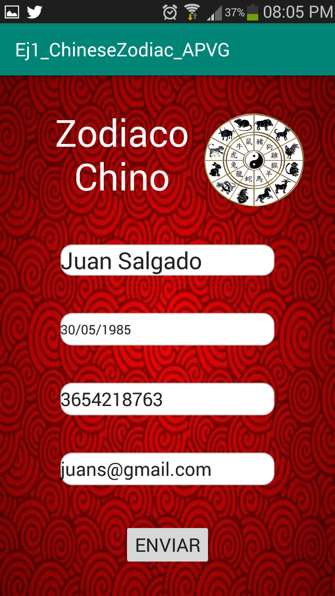
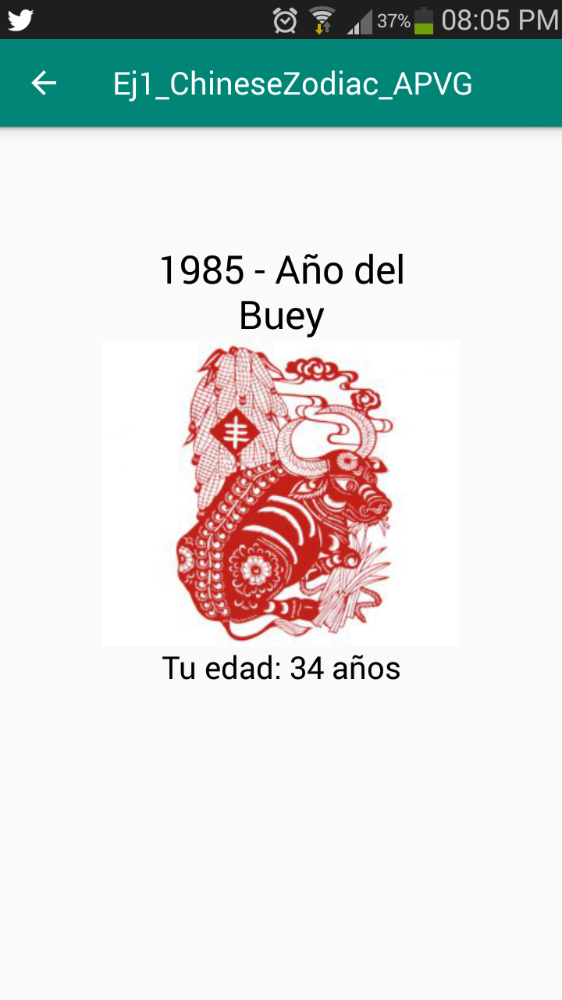

# Ej1_CZ_APVG - Aplicación que muestra el Zodiaco Chino

Aplicación que muestra el signo zodiacal chino del usuario de acuerdo a su fecha de nacimiento. Incluye soporte para lenguaje en español e inglés.

La aplicación se presenta con tres activities:

* <b>Primera Activity</b> .- Ésta presenta un formulario que incluye campos para el nombre del usuario, su fecha de nacimiento, su número de cuenta y correo electrónico.
                      Incluye validaciones para asegurar que el formulario sea llenado por completo, que el número de cuenta sea de 10 dígitos obligatoriamente y que la
                       fecha de nacimiento se encuentre en un formato válido.
                       

                       
* <b>Segunda Activity</b>.- Ésta activity indica el signo zodiacal chino del usuario de acuerdo a su fecha de nacimiento. Además, muestra la edad calculada de éste mismo.

* <b>Tercera Activity </b>.- La tercera activity se dispara únicamente al presionar el símbolo zodiacal que contiene a los 12 signos, y que se encuentra en la primera activity junto al
                            nombre de la aplicación. Ésta muestra el nombre del curso en cuestión, el grupo y el nombre del estudiante desarrollador.
                            

*Imágenes del zodiaco chino obtenidas de: http://www.ccl.uanl.mx/los-doce-animales-del-horoscopo-chino/

*Ícono de aplicación obtenido de: https://www.flaticon.com/packs/chinese-new-year-12
  
                            
                            

                      
